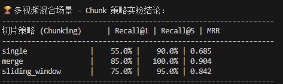
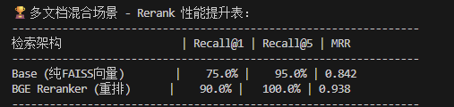
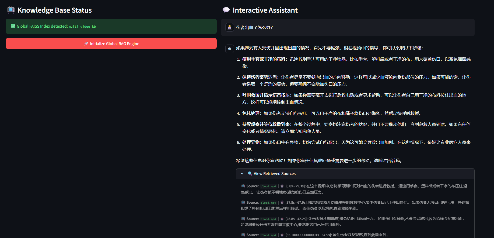
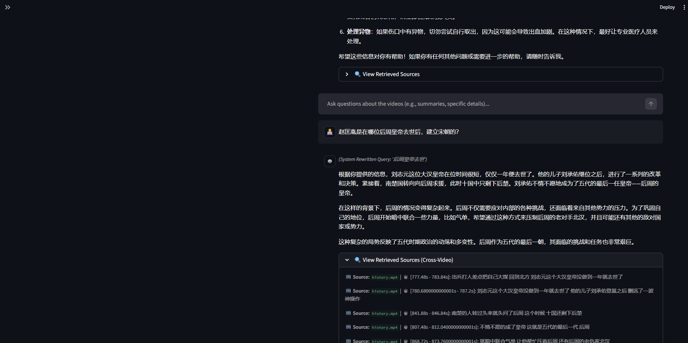

# Video-RAG: 跨视频多模态检索与语义分析系统

本项目实现了一个基于 **RAG (Retrieval-Augmented Generation)** 架构的本地化视频内容分析系统。通过集成 ASR (语音识别)、向量检索与交叉编码器重排技术，系统能够对多源视频进行自动化索引，并提供具备精确时间戳溯源的问答能力。

## 🛠 技术架构

系统流水线由数据预处理、多维索引构建、两阶段检索链路以及生成式问答四个核心环节组成。

- **音频转录与预处理**：利用 `faster-whisper` 模型提取视频音频轨并转录文本，生成的 JSON 缓存包含每个 Segments 的精确起止时间。

- **语义分块 (Chunking)**：针对视频流式文本特性，实现了单句切分 (Single)、定长合并 (Merge) 以及滑动窗口 (Sliding Window) 三种策略，以解决长文本检索中的上下文缺失问题。

- **向量化存储**：使用 `BGE-m3` 模型将文本块映射为 1024 维密集向量，并利用 `FAISS` 进行索引构建与持久化。

- **多阶段检索链路**：系统采用 Bi-Encoder 进行初筛召回，随后使用 Cross-Encoder (`bge-reranker-base`) 对结果进行深度语义评分与排序重排。

## 📊 核心指标定义 (Evaluation Metrics)

为确保评测的严谨性，系统采用以下指标评估检索质量：

- **Recall@K**: 正确答案出现在检索结果前 $K$ 名的比例。

- **MRR (Mean Reciprocal Rank)**: 衡量排序质量的核心指标，计算公式为：
  
  $$MRR = \frac{1}{|Q|} \sum_{i=1}^{|Q|} \frac{1}{rank_i}$$

---

#### 1. 切片策略性能对比 (Chunking Strategy Benchmark)

针对多视频混合干扰场景，对比了不同分块粒度对语义检索鲁棒性的影响。

| **策略类型 (Strategy)** | **Recall@1** | **Recall@5** | **MRR**   | **核心特征 (Key Logic)** |
| ------------------- | ------------ | ------------ | --------- | -------------------- |
| **Single**          | 55.0%        | 90.0%        | 0.685     | 原始分片，粒度最细但语义支离破碎     |
| **Merge**           | **85.0%**    | **100.0%**   | **0.904** | 定长合并，上下文背景最丰富        |
| **Sliding Window**  | 75.0%        | 95.0%        | 0.842     | 步长重叠，兼顾定位精度与语义关联     |

<details>

<summary>📸 点击查看实验终端跑图原始证据 (Raw Terminal Log)</summary>

<p align="center">



</p>

</details>

---

#### 2. Rerank 性能增益验证 (Reranking Performance Lift)

在混合 3 个视频的复杂干扰池中，验证 BGE-Reranker 对排序精度的二次优化效果。

| **检索架构 (Architecture)**       | **Recall@1** | **MRR**   | **增益 (Lift)**                    |
| ----------------------------- | ------------ | --------- | -------------------------------- |
| **Base (Bi-Encoder)**         | 75.0%        | 0.842     | 基准线                              |
| **BGE Reranker (Re-ranking)** | **90.0%**    | **0.938** | **+15.0% Recall@1 / +11.4% MRR** |

<details>

<summary>📸 点击查看实验终端跑图原始证据 (Raw Terminal Log)</summary>

<p align="center">



</p>

</details>

## 📂 目录结构

Plaintext

```
├── assets               #[Local Directory Structure](assets/image)
├── data/
│   ├── videos/          # 原始视频文件目录 (.mp4)
│   ├── eval/            # 自动化评测集与 Ground Truth
│   ├── index/           # FAISS 向量索引持久化文件
│   └── tmp/             # Whisper 转录 JSON 缓存
├── src/
│   ├── config.py         # 环境路径与模型参数配置
│   ├── data_processor.py # ASR 逻辑与切片算法实现
│   ├── rag_engine.py     # 向量检索与重排核心引擎
│   ├── eval.py           # 切片策略量化评测脚本
│   ├── eval_rerank.py    # 检索链路性能评估脚本
│   └── web_ui.py         # 基于 Streamlit 的交互前端
├── requirements.txt      # 依赖库清单
└── README.md
```

## 🚀 部署指引

### 1. 基础环境

- **Python**: 3.9+

- **FFmpeg**: 需自行安装二进制包并配置系统环境变量。

- **Models**: 系统首次运行将自动从 HuggingFace Hub 拉取所需的 `BGE` 与 `Whisper` 模型权重。

### 2. 执行步骤

Bash

```
# 安装依赖
pip install -r requirements.txt

# 自动化构建混合索引
python src/main.py

# 启动可视化分析系统
streamlit run src/web_ui.py
```

## 🚀 运行效果预览 (Demo)

### 跨视频语义溯源 系统不仅能给出回答，还能从混合知识库中准确识别视频来源（如 `blood.mp4`, `history.mp4`）并定位到具体秒数。 >

>  

> 

## 📌 免责声明

本仓库仅包含核心源代码、评测基准数据及环境配置文件。由于体积与版权限制，仓库内**不包含** FFmpeg 工具包、模型权重文件及原始视频媒体。
